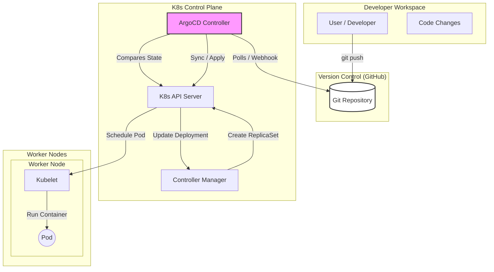

# Scalable Platform Engineering & Automated Governance

This guide details the transition from manual cluster management to automated, professional platform engineering using GitOps, Policy-as-Code, and Service Mesh.

---

## 1. GitOps (The Gold Standard)

**Concept**: GitOps uses a Git repository as the "Source of Truth" for your infrastructure and applications. Instead of running `kubectl apply -f ...` manually, you commit YAMLs to Git, and a controller (ArgoCD) syncs the cluster to match Git.

### 1.0 High-Level GitOps Flow

The following diagram illustrates the complete flow from a developer pushing code to the application running as a Pod.



### 1.1 ArgoCD Installation & Setup
**Pre-requisite**: A running Kubernetes cluster.

1.  **Install ArgoCD**:
    ```bash
    kubectl create namespace argocd
    kubectl apply -n argocd -f https://raw.githubusercontent.com/argoproj/argo-cd/stable/manifests/install.yaml
    ```
2.  **Access the UI**:
    ```bash
    kubectl port-forward svc/argocd-server -n argocd 8080:443
    # Username: admin
    # Password: kubectl -n argocd get secret argocd-initial-admin-secret -o jsonpath="{.data.password}" | base64 -d
    ```

### 1.2 SOP: Deploying an Application (The GitOps Way)
Instead of `kubectl apply`, you create an **Application** CRD.

**Command**:
```bash
argocd app create guestbook \
    --repo https://github.com/argoproj/argocd-example-apps.git \
    --path guestbook \
    --dest-server https://kubernetes.default.svc \
    --dest-namespace default
```

**Declarative YAML (Recommended)**:
```yaml
apiVersion: argoproj.io/v1alpha1
kind: Application
metadata:
  name: guestbook
  namespace: argocd
spec:
  project: default
  source:
    repoURL: https://github.com/argoproj/argocd-example-apps.git
    targetRevision: HEAD
    path: guestbook
  destination:
    server: https://kubernetes.default.svc
    namespace: default
  syncPolicy:
    automated: # Enable auto-sync
      prune: true
      selfHeal: true
```

### 1.3 Troubleshooting ArgoCD
**Issue: App is "OutOfSync"**
*   **Cause**: Someone manually edited a resource (e.g., `kubectl edit svc`). ArgoCD detects the drift using "SelfHeal".
*   **Resolution**:
    1.  Check the diff in UI or CLI: `argocd app diff guestbook`
    2.  Hard Sync (Overwrite cluster with Git state):
        ```bash
        argocd app sync guestbook --prune
        ```

**Issue: Sync Failed / Hook Failed**
*   **Cause**: Invalid YAML in Git or immutable field change.
*   **Resolution**:
    1.  Check logs: `kubectl logs -n argocd -l app.kubernetes.io/name=argocd-application-controller`
    2.  Fix YAML in Git → Commit → ArgoCD auto-retries.

---

## 2. Admission Controllers (Policy as Code)

**Concept**: A security gatekeeper that intercepts requests to the API Server. If a request (e.g., "Deploy Pod") violates a policy, it is rejected **before** it enters the cluster.

**Tool**: **Kyverno** (Kubernetes Native)

### 2.1 Installation
```bash
kubectl create -f https://github.com/kyverno/kyverno/releases/latest/download/install.yaml
```

### 2.2 Common Policies & Implementation

#### Policy A: Enforce Resource Limits (Stop "Noisy Neighbors")
**Issue**: Developers deploy pods without specifying Memory/CPU, causing node starvation.
**Solution**: Block any Pod without `requests` and `limits`.

```yaml
apiVersion: kyverno.io/v1
kind: ClusterPolicy
metadata:
  name: require-resources
spec:
  validationFailureAction: Enforce # Block the request
  rules:
  - name: check-resources
    match:
      resources:
        kinds:
        - Pod
    validate:
      message: "CPU and memory resource requests and limits are required."
      pattern:
        spec:
          containers:
          - resources:
              requests:
                memory: "?*"
                cpu: "?*"
              limits:
                memory: "?*"
```

#### Policy B: Block Public/Unsafe Images
**Issue**: Preventing usage of `latest` tags (unstable) or public Docker Hub images (rate limits/security).
**Solution**: Ensure images come from your private registry (e.g., ECR/GCR).

```yaml
apiVersion: kyverno.io/v1
kind: ClusterPolicy
metadata:
  name: restrict-image-registries
spec:
  validationFailureAction: Enforce
  rules:
  - name: validate-registries
    match:
      resources:
        kinds:
        - Pod
    validate:
      message: "Images must be pulled from my-private-registry.io."
      pattern:
        spec:
          containers:
          - image: "my-private-registry.io/*"
```

### 2.3 Troubleshooting Blocked Deployments
**Symptom**: `kubectl apply` fails with `Error: admission webhook "validate.kyverno.svc" denied the request`.

**Resolution**:
1.  Read the error message carefully—it tells you *exactly* which policy failed.
    *   *Example*: `Policy violation: require-resources: CPU and memory resource requests...`
2.  Fix the local YAML to comply.
3.  **Emergency Bypass** (Admin only):
    Change `validationFailureAction: Enforce` to `Audit` in the ClusterPolicy. This allows the pod but alerts in the logs.

---

## 3. Service Mesh (Istio)

**Concept**: Adds a dedicated infrastructure layer for service-to-service communication. It solves:
1.  **Security**: mTLS (Mutual TLS) everywhere.
2.  **Traffic Control**: Canary, Blue/Green, Circuit Breaking.
3.  **Observability**: Tracing requests across microservices.

### 3.1 Installation (Istio Profile: Demo)
1.  Download `istioctl`: `curl -L https://istio.io/downloadIstio | sh -`
2.  Install:
    ```bash
    istioctl install --set profile=demo -y
    ```
3.  **Enable Sidecar Injection**:
    Istio needs to inject a proxy (Envoy) next to your app container.
    ```bash
    kubectl label namespace default istio-injection=enabled
    ```
    *Note: You must restart existing pods for injection to happen: `kubectl rollout restart deploy`*

### 3.2 Feature: Canary Deployment (Traffic Splitting)
**Scenario**: You have `v1` of an app running. You want to send 5% of traffic to `v2` to test it safely.

1.  **Define Gateways and VirtualServices**:

    **DestinationRule** (Define subsets):
    ```yaml
    apiVersion: networking.istio.io/v1alpha3
    kind: DestinationRule
    metadata:
      name: my-app
    spec:
      host: my-app
      subsets:
      - name: v1
        labels:
          version: v1
      - name: v2
        labels:
          version: v2
    ```

    **VirtualService** (Split traffic):
    ```yaml
    apiVersion: networking.istio.io/v1alpha3
    kind: VirtualService
    metadata:
      name: my-app
    spec:
      hosts:
      - my-app
      http:
      - route:
        - destination:
            host: my-app
            subset: v1
          weight: 95
        - destination:
            host: my-app
            subset: v2
          weight: 5
    ```


### 3.3 Troubleshooting Service Mesh
**Issue: Service 503 Service Unavailable**
*   **Cause**: Pilot (Istio control plane) hasn't synced configuration to the sidecar, or mTLS mismatch.
*   **Resolution / Checks**:
    1.  **Check Proxy Status**:
        ```bash
        istioctl proxy-status
        ```
    2.  **Verify mTLS**:
        If you have `PERMISSIVE` mode off, ensure both sides have certs.
    3.  **Analyze Namespace**:
        ```bash
        istioctl analyze -n default
        ```
        This tool detects misconfigurations automatically.

**Issue: Sidecar not injecting**
*   **Cause**: Namespace not labeled or Pod has `hostNetwork: true`.
*   **Check**:
    ```bash
    kubectl get ns -L istio-injection
    kubectl describe pod <pod-name> # Look for 'istio-proxy' container
    ```

---

## 4. Official Documentation & Setup Resources

Bookmark these for deep dives and latest installation binaries.

### GitOps (ArgoCD)
-   **Official Docs**: [argo-cd.readthedocs.io](https://argo-cd.readthedocs.io/en/stable/)
-   **Getting Started Guide**: [ArgoCD Getting Started](https://argo-cd.readthedocs.io/en/stable/getting_started/)
-   **GitHub Repo**: [argoproj/argo-cd](https://github.com/argoproj/argo-cd)
-   **Architecture**: [Architectural Overview](https://argo-cd.readthedocs.io/en/stable/operator-manual/architecture/)

### Admission Controllers (Kyverno)
-   **Official Docs**: [kyverno.io/docs](https://kyverno.io/docs/)
-   **Installation Guide**: [Kyverno Installation](https://kyverno.io/docs/installation/)
-   **Policy Library**: [Kyverno Policies](https://kyverno.io/policies/) (Copy-paste production policies)

### Service Mesh (Istio)
-   **Official Docs**: [istio.io/latest/docs](https://istio.io/latest/docs/)
-   **Setup/Install Guide**: [Istio Installation](https://istio.io/latest/docs/setup/getting-started/)
-   **Tasks & Examples**: [Istio Tasks](https://istio.io/latest/docs/tasks/)
-   **Debugging FAQ**: [Istio Operations & Troubleshooting](https://istio.io/latest/docs/ops/)
