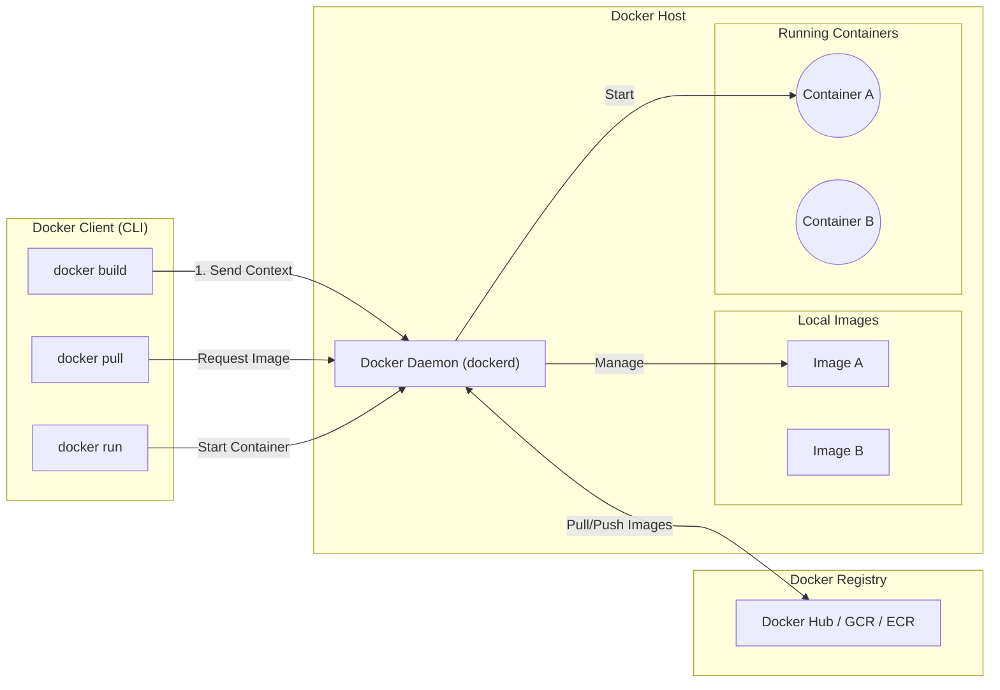
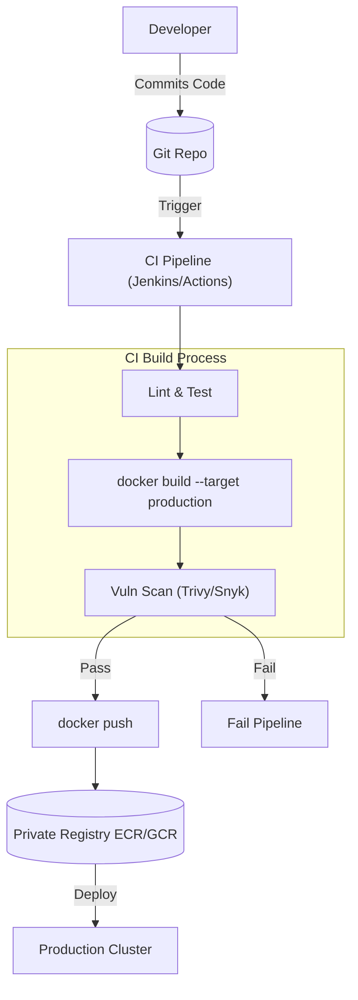

# Docker Production Guide: From Architecture to Operations

This document serves as a comprehensive guide to understanding, managing, and troubleshooting Docker in a production environment.

---

## 1. High-Level Architecture & Design

Docker operates on a client-server architecture. The Docker Client talks to the Docker Daemon, which does the heavy lifting of building, running, and distributing your Docker containers.

### 1.1 Architecture Diagram



### 1.2 Key Components

1.  **Docker Daemon (`dockerd`)**: The background process that manages Docker objects (images, containers, networks, volumes). It listens for API requests.
2.  **Docker Client (`docker`)**: The CLI tool you use. It communicates with the daemon via REST API (over UNIX sockets or a network interface).
3.  **Docker Images**: Read-only templates with instructions for creating a Docker container. Built from a `Dockerfile`.
4.  **Docker Containers**: Runnable instances of an image. You can create, start, stop, move, or delete a container.
5.  **Docker Registry**: Stores Docker images (e.g., Docker Hub, AWS ECR, Google GCR).

---

## 2. Essential Commands for Production

### 2.1 Container Lifecycle
| Command | Description |
| :--- | :--- |
| `docker run -d --name <name> -p 80:80 <image>` | Run a container in detached mode, exposing ports on the host. |
| `docker stop <container_id>` | Gracefully stop the container (SIGTERM). |
| `docker kill <container_id>` | Forcefully stop the container (SIGKILL). |
| `docker rm -f <container_id>` | Forcefully remove a running container. |
| `docker update --restart=always <container_id>` | Update restart policy for an existing container. |

### 2.2 Inspection & Observability
| Command | Description |
| :--- | :--- |
| `docker ps -a` | List all running and stopped containers. |
| `docker logs --tail 100 -f <container_id>` | Stream the last 100 lines of logs. |
| `docker inspect <container_id>` | View detailed JSON configuration (IPs, Volumes, Env Vars). |
| `docker stats` | Live stream of CPU, Memory, and Network usage. |
| `docker diff <container_id>` | Inspect changes to files/directories on the container's filesystem. |

### 2.3 Image Management
| Command | Description |
| :--- | :--- |
| `docker build -t <name>:<tag> .` | Build an image from a Dockerfile in current directory. |
| `docker history <image>` | Show the history of an image (layers and sizes). |
| `docker system prune -a` | **Dangerous**: Remove all unused containers, networks, images (not just dangling ones). |

### 2.4 Networking & Connectivity
| Command | Description |
| :--- | :--- |
| `docker network create <name>` | Create a custom bridge network (for container DNS resolution). |
| `docker network connect <net> <container>` | Connect a running container to a network. |
| `docker exec -it <container> sh` | Get a shell inside the container (use `bash` if available). |

---

## 3. Production Issues & Troubleshooting SOPs

### 3.1 Issue: "No Space Left on Device"
**Symptom**: Builds fail or containers crash because the `/var/lib/docker` directory is full.
**Root Cause**: Local image cache too large, stopped containers not removed, or huge log files.

**SOP Resolution**:
1.  **Prune System**:
    ```bash
    docker system prune -a --volumes --force
    ```
2.  **Check Log Sizes**:
    Docker logs (JSON format) can grow indefinitely.
    Fix: Configure log rotation in `/etc/docker/daemon.json`:
    ```json
    {
      "log-driver": "json-file",
      "log-opts": {
        "max-size": "10m",
        "max-file": "3"
      }
    }
    ```
3.  **Find Large Containers**:
    ```bash
    docker ps -s
    ```

### 3.2 Issue: Container Exits Immediately (CrashLoop)
**Symptom**: `docker ps` shows status `Exited (1) 2 seconds ago`.
**Root Cause**: The main process (PID 1) finished or crashed.

**SOP Resolution**:
1.  **Check Logs**:
    ```bash
    docker logs <container_id>
    ```
2.  **Debug Entrypoint**:
    Overwrite the entrypoint to keep the container running for inspection.
    ```bash
    docker run -it --entrypoint /bin/sh <image_name>
    ```

### 3.3 Issue: "Connection Refused" between Containers
**Symptom**: App A cannot talk to DB B.
**Root Cause**: Containers are on different networks or using `localhost` instead of the service name.

**SOP Resolution**:
1.  **Check Network**:
    Ensure both are on the same custom bridge network (default bridge does **not** support DNS by name).
    ```bash
    docker network create my-net
    docker network connect my-net container_a
    docker network connect my-net container_b
    ```
2.  **Verify DNS**:
    Exec into Container A and try to ping Container B by name.
    ```bash
    docker exec -it container_a ping container_b
    ```

### 3.4 Issue: Slow Builds
**Symptom**: CI/CD pipeline takes 10+ minutes to build a small change.
**Root Cause**: Inefficient Dockerfile ordering (cache busting) or large context.

**SOP Resolution**:
1.  **Optimize Layer Ordering**: Put mostly stable commands (installing deps) *before* changing code (COPY src).
    *   *Bad*: `COPY . .` -> `RUN npm install`
    *   *Good*: `COPY package.json .` -> `RUN npm install` -> `COPY . .`
2.  **Use .dockerignore**: Exclude `.git`, `node_modules`, `build` folders from the build context.

---

## 4. The Recommended Production Workflow

To scale securely, follow this **Golden Image** pipeline.



### Key Practices:
1.  **Multi-Stage Builds**: Use a build stage to compile apps (with SDKs) and a final stage with a minimal runtime (Alpine/Distroless).
    ```dockerfile
    # Build Stage
    FROM maven:3.8 AS builder
    COPY . .
    RUN mvn package

    # Runtime Stage
    FROM openjdk:17-slim
    COPY --from=builder /target/app.jar app.jar
    CMD ["java", "-jar", "app.jar"]
    ```
2.  **Tagging Strategy**: Never use `:latest` in production. Use semantic versioning (`v1.0.1`) or Git Commit SHA (`sha-a1b2c`).
3.  **Distroless Images**: Use "distroless" images (e.g., `gcr.io/distroless/java`) to remove shells and package managers for security.

---

## 5. Official References

*   **Docker Documentation**: [docs.docker.com](https://docs.docker.com/)
*   **Docker CLI Reference**: [CLI Commands](https://docs.docker.com/engine/reference/commandline/cli/)
*   **Dockerfile Best Practices**: [Best Practices](https://docs.docker.com/develop/develop-images/dockerfile_best-practices/)
*   **Networking Guide**: [Container Networking](https://docs.docker.com/network/)
