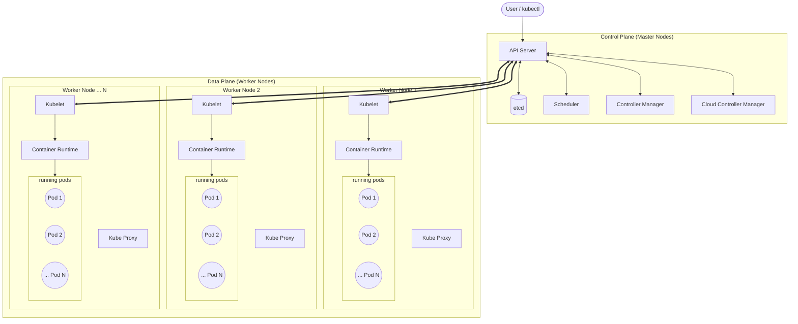

# Kubernetes Architecture & Design Guide

This document provides a comprehensive breakdown of the Kubernetes architecture, detailing the components of the Control Plane and Data Plane, their interactions, and the lifecycle of a request.

---

## 1. High-Level Architecture Diagram

Kubernetes follows a **Master-Worker** architecture (Control Plane & Data Plane). A single cluster consists of **one or more Control Plane nodes** and **multiple Worker Nodes** (up to 5,000+). Each Worker Node hosts **multiple Pods** (up to 110 per node by default).

### Scalability Limits (Approximate)
*   **Nodes per cluster**: ~5,000
*   **Pods per cluster**: ~150,000
*   **Pods per node**: ~110 (configurable)
*   **Containers per pod**: Unlimited (practically limited by resources)

---

## 2. The Control Plane (The "Brain")

The Control Plane makes global decisions about the cluster (e.g., scheduling) and detects/responds to cluster events (e.g., starting a new pod when a deployment's replicas field is unsatisfied).

### 2.1 kube-apiserver
*   **Role**: The front-end for the Kubernetes control plane. It is the **only** component that interacts directly with `etcd`.
*   **Key Functions**:
    *   **Authentication & Authorization**: Validates user requests (via certificates, tokens, RBAC).
    *   **Gatekeeper**: Validates object data (is this YAML valid?).
    *   **API Exposure**: Exposes the REST API (port 6443) for all resources.
*   **Scalability**: Stateless and designed to scale horizontally (run multiple instances behind a load balancer).

### 2.2 etcd
*   **Role**: The backing store for all cluster data.
*   **Key Characteristics**:
    *   **Consistent**: Uses the RAFT consensus algorithm.
    *   **High Availability**: Typically run as a 3 or 5 node cluster.
    *   **Response**: Extremely fast key-value store.
*   **Critical Note**: If `etcd` data is lost, the cluster state is lost. Backups are mandatory.

### 2.3 kube-scheduler
*   **Role**: Watches for newly created Pods with no assigned `nodeName` and selects a node for them to run on.
*   **Decision Process**:
    1.  **Filtering (Predicates)**: Which nodes *can* run this pod? (e.g., sufficient RAM? Taints/Tolerations match?)
    2.  **Scoring (Priorities)**: Which node is the *best* fit? (e.g., Spread constraints, Image locality).
    3.  **Binding**: Tells the API server, "Bind Pod X to Node Y."

### 2.4 kube-controller-manager
*   **Role**: Runs controller processes. Though logically separate, they are compiled into a single binary.
*   **Examples**:
    *   **Node Controller**: Notices and responds when nodes go down.
    *   **Replication Controller**: Ensures correct number of Pod replicas.
    *   **Endpoint Controller**: Populates Endpoints objects (joins Services & Pods).

### 2.5 cloud-controller-manager
*   **Role**: Embeds cloud-specific control logic. It lets you link your cluster into your cloud provider's API.
*   **Examples**:
    *   Creating AWS Load Balancers (for Services of type `LoadBalancer`).
    *   Managing storage volumes (EBS/PD).

---

## 3. The Data Plane (Worker Nodes)

The Worker Nodes maintain running pods and provide the Kubernetes runtime environment.

### 3.1 kubelet
*   **Role**: The primary "agent" that runs on each node.
*   **Function**:
    *   Registers the node with the API Server.
    *   Watches `PodSpecs` assigned to the node.
    *   Instructs the container runtime (CRI) to pull images and start containers.
    *   Reports node status and pod status back to the API Server.
    *   Runs **Liveness/Readiness Probes**.

### 3.2 kube-proxy
*   **Role**: Maintains network rules on nodes.
*   **Function**: Enables network communication to your Pods from network sessions inside or outside of your cluster.
*   **Modes**:
    *   **iptables (Default/Common)**: Uses Linux connection tracking. Good for small/medium clusters.
    *   **IPVS (Scale)**: Uses hash tables, better performance for large clusters with thousands of Services.

### 3.3 Container Runtime (CRI)
*   **Role**: The software responsible for running containers.
*   **Implementations**:
    *   **containerd**: Industry standard (Docker's underlying runtime).
    *   **CRI-O**: Lightweight runtime for K8s.
    *   **Docker Engine**: (Deprecated as of K8s v1.24+, replaced by direct containerd usage).

---

## 4. Design Deep Dive: The Lifecycle of a Request (Pod Creation)

Understanding this flow is critical for debugging "Pending" pods.

1.  **User Request**: You run `kubectl run nginx --image=nginx`.
    *   Sends HTTP POST to **API Server**.
2.  **API Server**:
    *   Authenticates User.
    *   Authorizes RBAC.
    *   Validates spec.
    *   Persists the Pod object to **etcd** (Status: *Pending*, Node: *None*).
3.  **Scheduler**:
    *   Watches API Server. Sees new Pod with no node.
    *   Runs Filter/Score algorithms.
    *   Updates Pod object in API Server: assigns `nodeName: worker-1`.
4.  **Kubelet (on Worker-1)**:
    *   Watches API Server. Sees Pod assigned to itself.
    *   Talks to **Container Runtime (CRI)**: "Pull `nginx` image. Start container."
    *   Updates Pod status to **Running** via API Server.
5.  **Kube-Proxy**:
    *   If the pod observes a Service, kube-proxy updates iptables rules on all nodes to route traffic to the new Pod IP.

---

## 5. Official References & Further Reading

*   **Kubernetes Components**: [Link](https://kubernetes.io/docs/concepts/overview/components/)
*   **Cluster Architecture**: [Link](https://kubernetes.io/docs/concepts/architecture/)
*   **API Server Reference**: [Link](https://kubernetes.io/docs/reference/command-line-tools-reference/kube-apiserver/)
*   **Controller Manager**: [Link](https://kubernetes.io/docs/reference/command-line-tools-reference/kube-controller-manager/)
